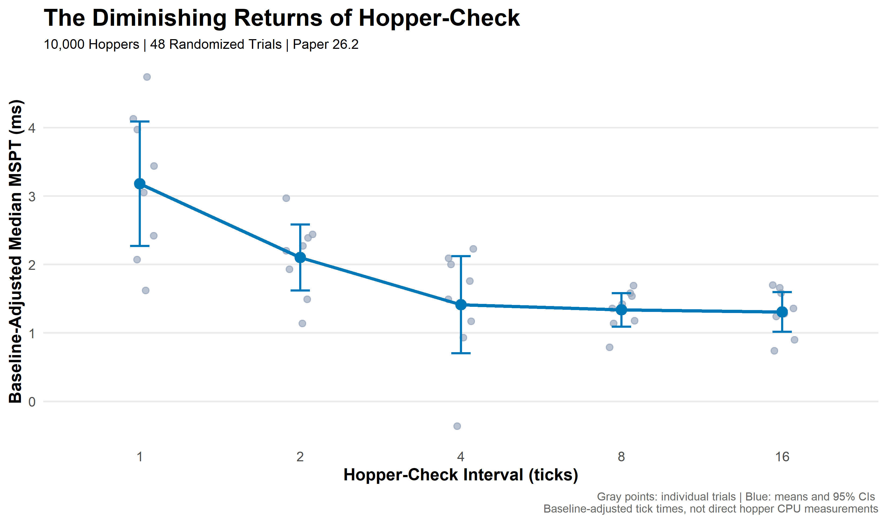
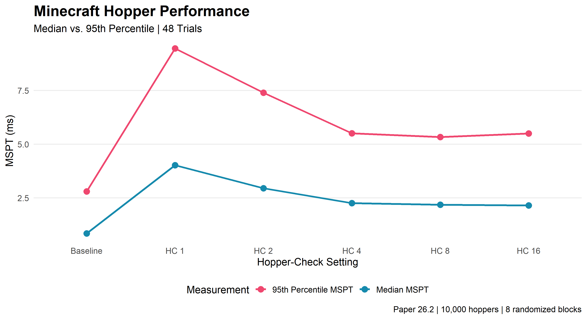
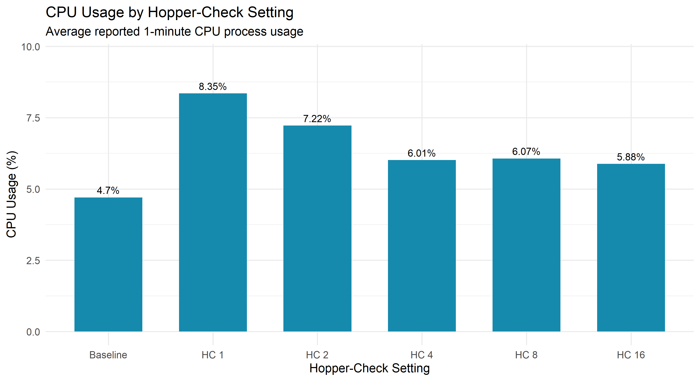
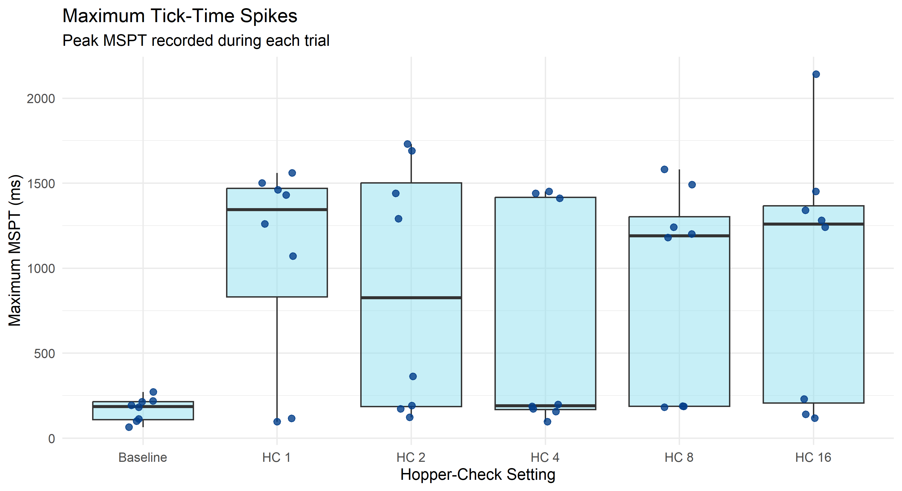

# Minecraft Hopper Performance Research

### The Diminishing Returns of Hopper-Check Intervals

**How much server performance do we actually gain by making hoppers check less frequently?**

An experimental investigation into Minecraft Paper server performance, using 10,000 hoppers, 48 randomized trials, and statistical analysis in R.



**[Full Experimental Methodology](METHODS.md)**

## Abstract

Hoppers are a fundamental component of technical Minecraft, enabling automated farms, sorting systems, and large-scale item transportation. However, substantial numbers of hoppers can contribute to server processing overhead.

Paper provides configuration options that allow administrators to modify how frequently hoppers check for available items. Increasing these intervals is commonly used as a performance optimization, but it introduces potential tradeoffs in hopper responsiveness.

This study investigates whether progressively increasing the hopper-check interval produces proportional improvements in server performance.

A randomized complete block experiment was conducted using 10,000 hoppers and five hopper-check settings: 1, 2, 4, 8, and 16. Eight repetitions of each setting and eight baseline measurements produced 48 trials.

The observed mean median MSPT decreased from 4.024 ms at HC 1 to 2.258 ms at HC 4. Further increases to HC 8 and HC 16 produced much smaller observed reductions.

The results are consistent with diminishing performance returns, although the sample size and measurement variability limit conclusions about the precise differences between individual settings.

**The central question is not whether increasing hopper-check reduces processing time, but how much improvement is obtained for each additional reduction in hopper responsiveness.**

---

## 1. Research Question

Increasing hopper-check intervals reduces how frequently hoppers attempt certain inventory checks.

This may improve server performance, but the relationship between checking frequency and server processing time is not necessarily proportional.

For example, increasing hopper-check from 1 to 2 doubles the interval between checks. Increasing from 8 to 16 also doubles that interval.

Do both changes provide comparable performance improvements?

### Hypothesis

Server performance will initially improve substantially as hopper-check increases, but improvements will diminish at higher intervals.

The relationship is expected to resemble a diminishing-returns curve rather than a linear decrease in processing time.

---

## 2. Experimental Setup

| Parameter | Configuration |
|---|---|
| Minecraft | Java Edition |
| Server Software | Paper 26.2 |
| Hosting | PebbleHost |
| Hopper Population | 10,000 |
| Hopper-Check Settings | 1, 2, 4, 8, 16 |
| Hopper-Transfer Setting | 8 |
| Baseline | No test hoppers |
| Randomized Blocks | 8 |
| Total Trials | 48 |
| Performance Monitoring | Spark |
| Statistical Analysis | R |

### Experimental Design

The investigation used a randomized complete block design.

Each block included all six experimental conditions:

- Baseline (no hoppers)
- HC 1
- HC 2
- HC 4
- HC 8
- HC 16

The order of these conditions was randomized within each block using R.

Eight blocks produced a total of 48 trials, with eight measurements per condition.

Randomization was used to reduce systematic bias associated with test order and changing server conditions.

### Testing Procedure

Each trial followed the same general procedure:

1. Configure the assigned hopper-check interval.
2. Restart the Paper server to apply the configuration.
3. Allow approximately 30 seconds for stabilization.
4. Start a 60-second Spark profiling session.
5. Record the available performance measurements.
6. Continue to the next randomized condition.

During baseline trials, the 10,000 test hoppers were removed.

### Measurements

The primary response variable was median milliseconds per tick (MSPT).

Additional measurements included:

- 95th-percentile MSPT
- Maximum MSPT
- Reported process CPU usage

MSPT measures the time required to process a server tick. Lower MSPT generally indicates greater remaining processing capacity.

**Measurement limitation:** The Spark summary statistics were recorded during the experiments, but their reporting windows have not been independently verified as matching each 60-second profiling session exactly.

Accordingly, these results characterize observed server performance under the tested conditions rather than direct measurements of hopper-specific CPU consumption.

---

## 3. Experimental Results

### 3.1 Overall Server Performance

The following values are the arithmetic means of eight trial-level measurements for each condition.

| Condition | Mean Median MSPT | Mean 95th-Percentile MSPT |
|---|---:|---:|
| Baseline | 0.844 ms | 2.80 ms |
| HC 1 | 4.024 ms | 9.46 ms |
| HC 2 | 2.948 ms | 7.40 ms |
| HC 4 | 2.258 ms | 5.50 ms |
| HC 8 | 2.181 ms | 5.33 ms |
| HC 16 | 2.151 ms | 5.50 ms |



The most substantial observed reductions in median MSPT occurred between HC 1 and HC 4.

Beyond HC 4, the curve flattened considerably.

HC 16 produced the lowest observed mean median MSPT, while HC 8 produced the lowest observed mean 95th-percentile MSPT among the hopper conditions.

The differences at higher settings were small relative to trial-to-trial variability.

### 3.2 Baseline-Adjusted Performance

Every randomized block included a baseline trial without the 10,000 hoppers.

Subtracting each block's baseline median MSPT from its hopper-condition measurements provides a baseline-adjusted measure of server performance.

| Hopper-Check | Mean Baseline-Adjusted MSPT |
|---|---:|
| HC 1 | 3.180 ms |
| HC 2 | 2.104 ms |
| HC 4 | 1.414 ms |
| HC 8 | 1.338 ms |
| HC 16 | 1.308 ms |

These values describe differences between measurements of overall server tick time. They do not establish the exact processing cost of individual hoppers.

### 3.3 Diminishing Returns

The mean reductions in median MSPT between consecutive settings were:

| Hopper-Check Change | Reduction in MSPT |
|---|---:|
| 1 → 2 | 1.076 ms |
| 2 → 4 | 0.690 ms |
| 4 → 8 | 0.076 ms |
| 8 → 16 | 0.030 ms |

Increasing the interval from 1 to 2 produced a much larger observed improvement than increasing it from 8 to 16.

The results therefore exhibit a diminishing-returns pattern in the sample means.

However, small observed differences should not automatically be interpreted as evidence that two settings perform equivalently.

### 3.4 CPU Usage

Spark's reported 1-minute process CPU usage was also recorded as a supplementary measurement.

| Condition | Mean Reported CPU Usage |
|---|---:|
| Baseline | 4.70% |
| HC 1 | 8.35% |
| HC 2 | 7.22% |
| HC 4 | 6.01% |
| HC 8 | 6.07% |
| HC 16 | 5.88% |



The observed CPU percentages generally decreased as hopper-check increased.

However, CPU usage was not strictly monotonic. HC 8 produced a slightly higher average reported CPU percentage than HC 4.

Because these are process-wide CPU measurements with potentially overlapping reporting windows, they should not be interpreted as isolated hopper CPU utilization.

### 3.5 Maximum Tick-Time Spikes

Maximum MSPT was recorded to investigate unusually slow ticks.



Several trials exhibited individual maximum MSPT values exceeding 1,000 milliseconds.

These events were not independently diagnosed. Their causes could involve processes other than the hopper-check setting.

Maximum MSPT is therefore treated as a diagnostic measurement rather than the primary basis for comparing hopper-check performance.

---

## 4. Statistical Analysis

The experiment was analyzed using R.

Because each randomized block contained measurements from every condition, the analysis accounted for the repeated-block structure.

### 4.1 Hopper-Check-Only Analysis

To determine whether hopper-check settings affected server performance independently of the no-hopper baseline, a Friedman test was conducted using only the five hopper-check conditions.

**Friedman test:** χ²(4) = 18.6, p = 0.0009417

The result was statistically significant (p < 0.001), indicating that at least some hopper-check settings differed in observed median MSPT.

The mean MSPT values exhibited diminishing improvements as hopper-check increased. However, the overall test does not identify which individual settings differ, and the previously conducted Holm-adjusted adjacent comparisons did not reach statistical significance.

These results support the conclusion that hopper-check configuration influences observed server performance under the tested conditions, while uncertainty remains about the magnitude of differences between neighboring settings.

### 4.2 Overall Differences

A repeated-measures ANOVA was conducted across all six conditions, including the no-hopper baseline.

**ANOVA:** F(5, 35) = 22.49, p = 4.9 × 10⁻¹⁰

A Friedman test was also performed as a nonparametric alternative.

**Friedman test:** χ²(5) = 29.00, p = 0.0000232

Both tests detected overall differences among the six experimental conditions.

Because these tests included the no-hopper baseline, their statistical significance does not by itself establish differences among the five hopper-check settings.

### 4.3 Adjacent Hopper-Check Comparisons

Paired t-tests were performed between neighboring hopper-check settings.

Holm correction was applied to address multiple comparisons.

| Comparison | Mean Difference | Holm-Adjusted p-value |
|---|---:|---:|
| HC 1 vs HC 2 | 1.076 ms | 0.149 |
| HC 2 vs HC 4 | 0.690 ms | 0.208 |
| HC 4 vs HC 8 | 0.076 ms | 1.000 |
| HC 8 vs HC 16 | 0.030 ms | 1.000 |

None of the adjacent-setting comparisons remained statistically significant at α = 0.05 after Holm correction.

This result should not be interpreted as proof that the settings are equivalent.

For example, the HC 8 versus HC 16 comparison produced an unadjusted 95% confidence interval of approximately −0.421 to 0.481 milliseconds.

Although the observed difference was only 0.030 ms, the interval indicates that meaningful differences cannot be ruled out with the current sample size.


---

## 5. Discussion

The experimental results suggest that hopper-check intervals may produce diminishing performance improvements as the interval increases.

At lower settings, changing the hopper-check interval produced substantial changes in observed server tick time.

At higher settings, additional improvements became comparatively small.

This distinction matters because Minecraft server performance is only one consideration when selecting a configuration.

Hoppers are components of larger technical systems. Storage networks, automated farms, sorting systems, and other machinery may depend on particular timing characteristics.

Increasing an interval to reduce processing demands can therefore introduce a tradeoff between computational performance and mechanical responsiveness.

### Performance Versus Functionality

The objective of server optimization should not necessarily be to minimize MSPT at any cost.

Instead, an administrator may want to identify a configuration that preserves reliable gameplay mechanics while providing most of the available performance improvement.

Under the conditions tested, HC 4, HC 8, and HC 16 produced relatively similar average median MSPT measurements.

Further investigation is required to determine whether those differences remain small under active item-transfer workloads or realistic multiplayer server conditions.

### Study Limitations

The findings should be interpreted with several limitations in mind:

- Only one Paper server environment was investigated.
- The experiment used one hopper population and arrangement.
- The primary measurements represent overall MSPT, not hopper-specific CPU time.
- Server restarts were required between configuration changes.
- Stabilization periods were approximately 30 seconds.
- Spark summary reporting windows were not independently verified against profiling windows.
- Each condition was measured eight times.
- Unusual maximum-MSPT spikes were not individually investigated.
- The functional reliability of hopper-based machinery was not directly evaluated.

These limitations are particularly relevant when applying the results to production Minecraft servers with different farms, plugins, player counts, or configurations.

---

## 6. Conclusion

This investigation evaluated Minecraft Paper server performance across five hopper-check settings using 10,000 hoppers and 48 randomized trials.

The observed mean median MSPT decreased substantially between HC 1 and HC 4, while increasing to HC 8 and HC 16 produced comparatively small additional reductions.

The 95th-percentile MSPT and process CPU observations also exhibited the largest overall changes at lower intervals.

A Friedman test restricted to the five hopper-check settings identified a statistically significant overall difference in observed median MSPT (χ²(4) = 18.6, p = 0.0009417). However, comparisons between individual adjacent settings did not remain statistically significant after Holm correction. This indicates that hopper-check configuration affects measured server performance, while the precise benefits of increasing the interval between neighboring settings remain uncertain.

The results are consistent with diminishing returns, but do not establish statistical equivalence among the higher hopper-check settings or identify a universally optimal configuration.

**Ultimately, server optimization is a question of tradeoffs: how much performance is gained, and what functionality is sacrificed to achieve it?**

---

## 7. Future Investigations

This project is intended to support continued experimental research into Minecraft server performance.

Potential future experiments include:

- Direct profiling of hopper-related processing functions.
- Comparing idle hoppers with actively transferring hoppers.
- Investigating hopper-transfer configurations.
- Testing alternative hopper arrangements and populations.
- Comparing server performance with redstone and storage machinery.
- Measuring item throughput and mechanical reliability.
- Repeating experiments on different Paper versions and server environments.
- Increasing trial counts to improve statistical precision.

---

## Data, Code, and Reproducibility

The repository contains the measurements, analysis scripts, and visualizations used in this investigation.

### Repository Structure

```text
Minecraft-Hopper-Performance-Research/
│
├── README.md
├── METHODS.md
│
├── data/
│   ├── hopper_randomized_trials.csv
│   └── hopper_complete_data.csv
│
├── analysis/
│   ├── hopper_analysis.R
│   └── hopper_additional_analysis.R
│
├── figures/
│   ├── hopper_diminishing_returns.png
│   ├── median_vs_p95.png
│   ├── cpu_usage.png
│   └── max_mspt_spikes.png
│
└── profiles/
    └── [available Spark profiles]
```

The `data/` directory contains the 48 randomized experimental measurements and additional recorded Spark summary statistics.

The `analysis/` directory contains the R scripts used to process the measurements, perform statistical tests, and produce figures.

The `figures/` directory contains the resulting graphs.
 
Available original Spark profiling records may be preserved in `profiles/` to support further investigation.

`METHODS.md` is intended for extended documentation of the experimental setup and procedure.

**Reproducibility note:** The repository structure should be updated to reflect only files actually committed to the project. Original measurements should be preserved without undocumented modifications.

---

*Independent research into Minecraft server performance, redstone systems, and technical game mechanics.*
